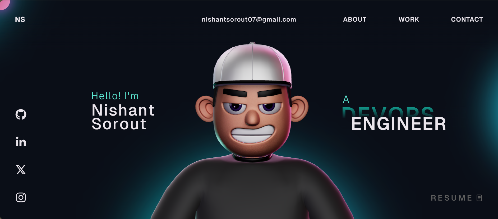

# ☁️ Nishant Sorout – Cloud & DevOps Engineer

## 🚀 About Me

Cloud & DevOps Engineer passionate about building scalable, reliable, and automated infrastructure.
I specialize in cloud platforms, CI/CD pipelines, containerization, and Infrastructure as Code.

---

## 🛠️ Tech Stack

### ☁️ Cloud Platforms

* AWS (EC2, S3, IAM, VPC, EKS, Lambda)

### ⚙️ DevOps & CI/CD

* Jenkins, GitHub Actions, GitLab CI/CD

### 🐳 Containerization & Orchestration

* Docker, Kubernetes (EKS)

### 🏗️ Infrastructure as Code

* Terraform, CloudFormation

### 📦 Configuration Management

* Ansible

### 🔍 Monitoring & Logging

* Prometheus, Grafana, CloudWatch

### 💻 Scripting & Tools

* Bash, Python, Git

---

## 📂 Portfolio Projects

### 🔹 Cloud Infrastructure Automation

* Built scalable infrastructure using Terraform
* Automated deployments with CI/CD pipelines

### 🔹 Kubernetes Deployment (EKS)

* Deployed containerized apps on AWS EKS
* Managed services, scaling, and networking

### 🔹 CI/CD Pipeline Implementation

* End-to-end pipeline using Jenkins/GitHub Actions
* Automated build, test, and deployment

---

## 📸 Portfolio Preview

---

## 📈 What I Focus On

* Infrastructure Automation
* Scalable Cloud Architecture
* Continuous Integration & Deployment
* Cost Optimization & Security Best Practices

---

## 🤝 Connect With Me

* 📧 Email: [nishantsorout07@gmail.com](mailto:nishantsorout07@gmail.com)
* 💼 LinkedIn: https://www.linkedin.com/in/nishantsorout08
* 🌐 Portfolio: https://nishantsorout08.github.io/My-Portfolio/